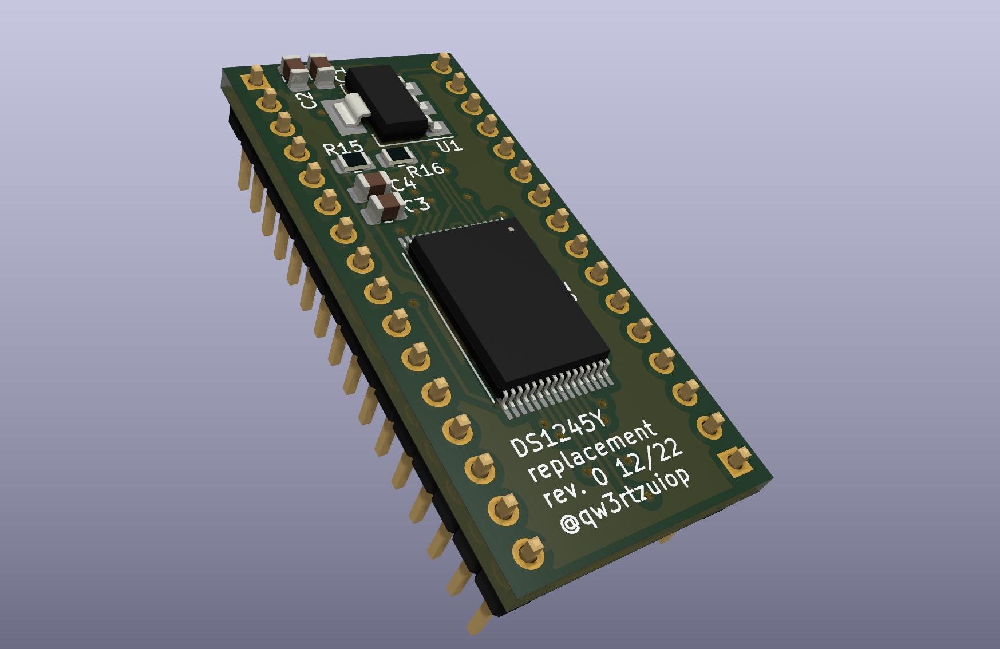

# DS1245Y drop in replacement with FM28V100 FRAM

Designed for Keithley 2001 (MEM2 option). More infos here:
https://xdevs.com/article/kei200x-mem/

Idea from TxB @eevblog forum: https://www.eevblog.com/forum/testgear/tek-csa7404-repair-project/msg1404582/#msg1404582

Now tested and working.

